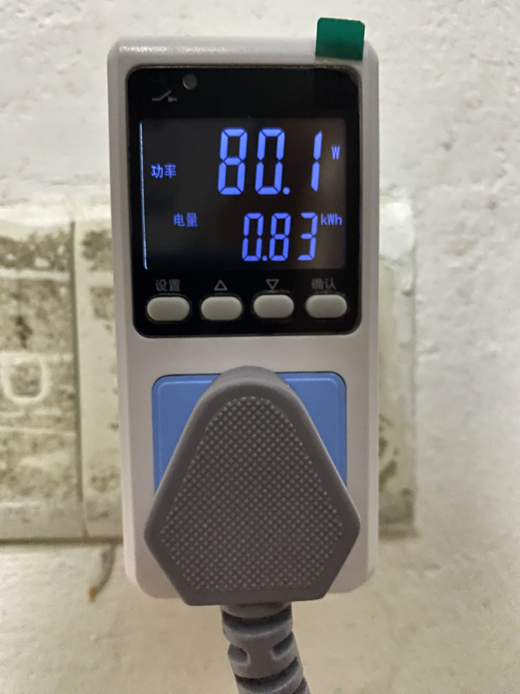
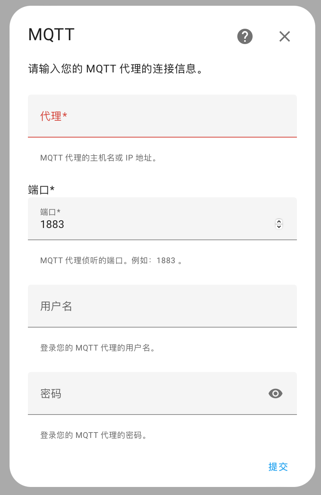
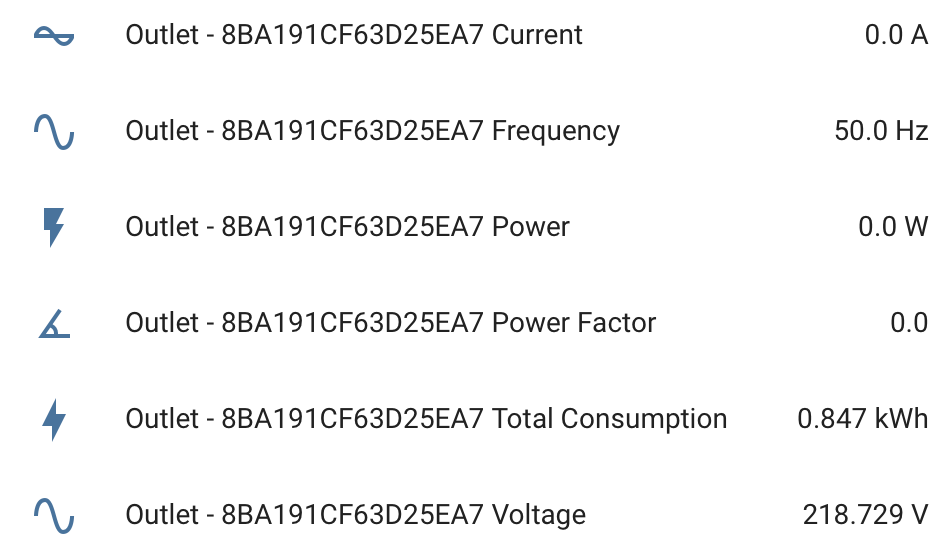

## Bluetooth Smart Socket Made Public

插座长这样



目前支持读取电压、电流、功率、功率因数、频率和总耗电量，支持多设备分开管理，提供HTTP API和MQTT接入

#### HTTP API

直接运行`web.py`，访问

```
http://<your address>:25000/online
```

返回一个json，以下是一个例子，其中`8BA191CF63D25EA7`是每个插座不同的UUID

```json
{
    "8BA191CF63D25EA7": { 
        "voltage": 219.223,
        "current": 0.0,
        "power": 0.0,
        "frequency": 50.0,
        "power_factor": 0.0,
        "accumulated_energy": 0.847,
        "ontime": 38201
    }
}
```

#### MQTT

首先需要一个MQTT Server，可以参考<a href="https://www.walnutpi.com/docs/home_assistant/mqtt/install">这里</a>

之后将各项参数填到mqtt.py里mqtt_settings的位置，自行替换

```python
mqtt_settings = Settings.MQTT(host='localhost', port=1883, username='user', password='pw')
```

运行mqtt.py，进入Home Assistant的设置 - 设备与服务 - 添加集成，选择MQTT - MQTT，输入和以上相同的内容



MQTT的Entity和Device可以自动识别

